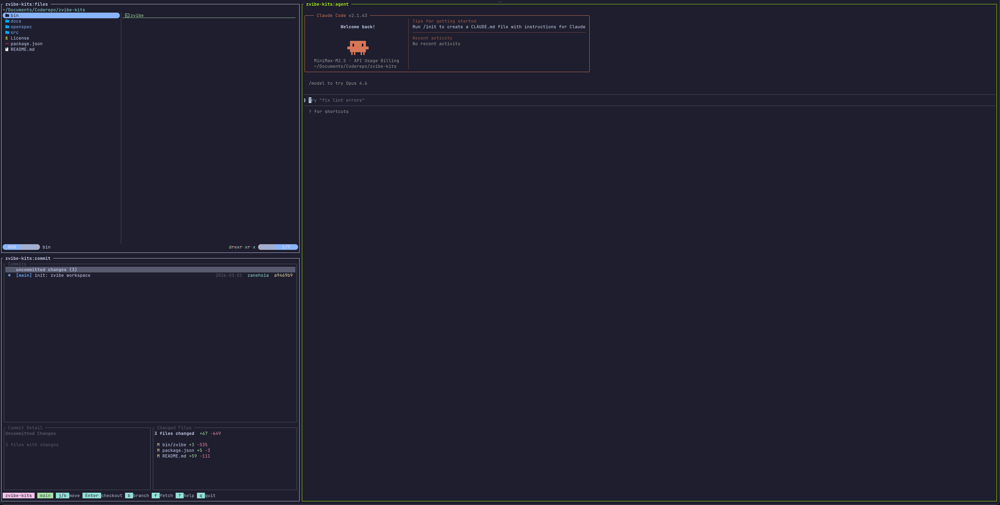
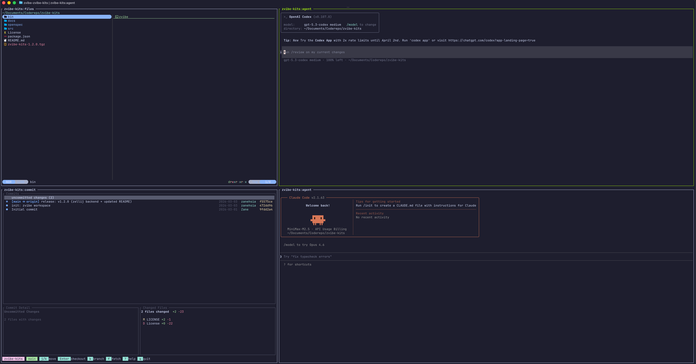
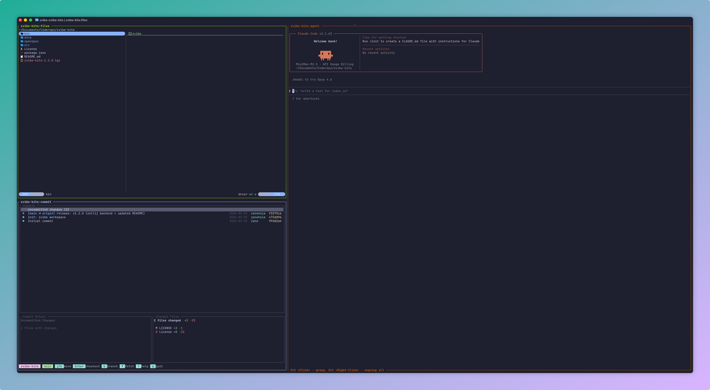

# zvibe

zvibe：一个面向你的 Vibe Coding Space 的会话优先管理面板。  
zvibe: a session-first panel for your vibe coding space.

## 插件用途

- 快速启动标准化开发面板（文件 / commit / agent）
- 一键切换单 Agent 与双 Agent（Agent Mode）
- 用统一命令管理后端、配置、诊断和更新

## 核心能力

- 多 Agent 启动：`codex` / `claude` / `opencode`
- Agent Mode：`zvibe code` 同时启动两个 Agent
- 终端面板组合：左上文件、左下 commit、右侧 Agent
- 可选右下 Terminal：`-t, --terminal`（单 Agent 模式）
- 后端策略：`zellij`
- 自动 Git 初始化防呆：在 `HOME`/根目录自动跳过，避免误初始化
- 配置管理与运维命令：`setup` / `config` / `status` / `update`
- Session 管理：`session list` / `session attach <name>` / `session kill <name>`
- Session 快捷参数：`session -l` / `session -a <name>` / `session -k <name>`
- JSON 输出能力：`--json`（便于脚本集成）

## 安装说明

### 方式 1：全局安装

```bash
npm i -g @zanetach/zvibe
```

### 方式 2：临时执行

```bash
npx @zanetach/zvibe setup
```

### 初始化建议

```bash
zvibe setup
zvibe status --doctor
```

### setup 一条龙行为

- `zvibe setup`：自动检测并安装缺失依赖，然后进入 Agent 交互配置；同时覆盖插件配置模板
- `zvibe setup --no-repair`：自动检测并安装缺失依赖，然后进入 Agent 交互配置；不覆盖已存在插件配置
- `zvibe setup --repair`：强制修复（覆盖）插件配置模板

## 使用方法

### 常用启动命令

```bash
zvibe
zvibe codex|claude|opencode
zvibe claude [agent-args...]
zvibe codex [agent-args...]
zvibe claude -p [agent-args...]
zvibe claude -- [agent-args...]
zvibe code
zvibe code -t
zvibe <dir> [codex|claude|opencode|code]
zvibe [codex|claude|opencode|code] <dir>
```

### 关键参数

- `--backend zellij`：后端配置（当前仅支持 zellij）
- 默认：同目录会话已存在时优先 attach；attach 失败再清理并重建
- `--fresh-session`：同目录会话存在时强制删除并重建
- `--reuse-session`：兼容参数（当前默认已是优先 attach）
- `-p, --passthrough`：将后续参数全部透传给 Agent（等价 `--` 分隔）
- `-t, --terminal`：单 Agent 模式下在右侧增加 Terminal
- `--no-repair`：`setup` 时不覆盖已有插件配置
- `--json`：JSON 结构化输出
- `--verbose`：输出诊断细节
- 说明：在 `codex|claude|opencode` 之后追加的参数会原样透传给对应 Agent CLI；使用 `-p` 或 `--` 可强制把后续参数全部透传

### 配置命令

```bash
zvibe config wizard
zvibe config get <key>
zvibe config set <key> <value>
zvibe config validate
zvibe config explain
zvibe session list
zvibe session attach <name>
zvibe session kill <name>
zvibe session -l
zvibe session -a <name>
zvibe session -k <name>
```

### 配置文件路径

- 默认：`~/.config/zvibe/config.json`
- 兼容读取旧路径：`~/.config/vibe/config.json`

示例配置：

```json
{
  "defaultAgent": "codex",
  "agentPair": ["opencode", "codex"],
  "backend": "zellij",
  "fallback": true,
  "rightTerminal": false,
  "autoGitInit": true
}
```

## 界面截图

### 单 Agent 模式（左侧 files/commit + 右侧 agent）



### 单 Agent + Terminal（右下 terminal）



### Agent Mode（`zvibe code`，右侧双 Agent 50/50）



## 开发

```bash
git clone https://github.com/Zanetach/zvibe.git
cd zvibe
node src/cli.js --help
```

发布前校验（防止“安装后不能用”）：

```bash
npm run verify:bin
npm pack
```

说明：
- `verify:bin` 会模拟 npm 全局安装时的 `bin` 符号链接场景并执行 `zvibe --help`
- `npm pack` 会触发 `prepack`，若启动器路径解析有问题会直接失败

## 许可证

MIT
